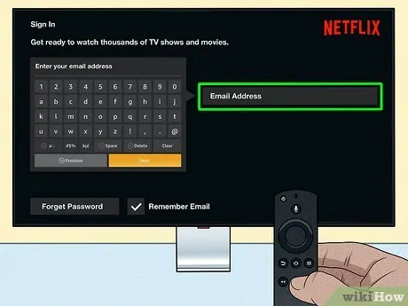

# feb 16 meeting

- when to use pop_to_root

clarify ViewControllers vs Programs

temp approach for setting system time
- leave viewcontroller as be
- add system time setting in SystemTime.py

understanding ButtonTest, having small trouble with SelectionManager
- _enter(0) vs _enter(1)
- adding siblings manually
- after i figure this out should segue into KeyboardVC easily

 

Layout
- qwerty vs abcdef
- make customizable

Modes
- full
- mini
- numpad 

------------
|hello!!!  |
------------
|qwertyuiop|
|asdfghjkl |
| zxcvbnm  |
------------